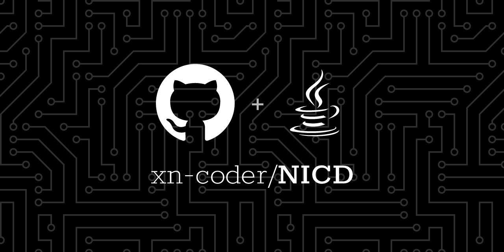
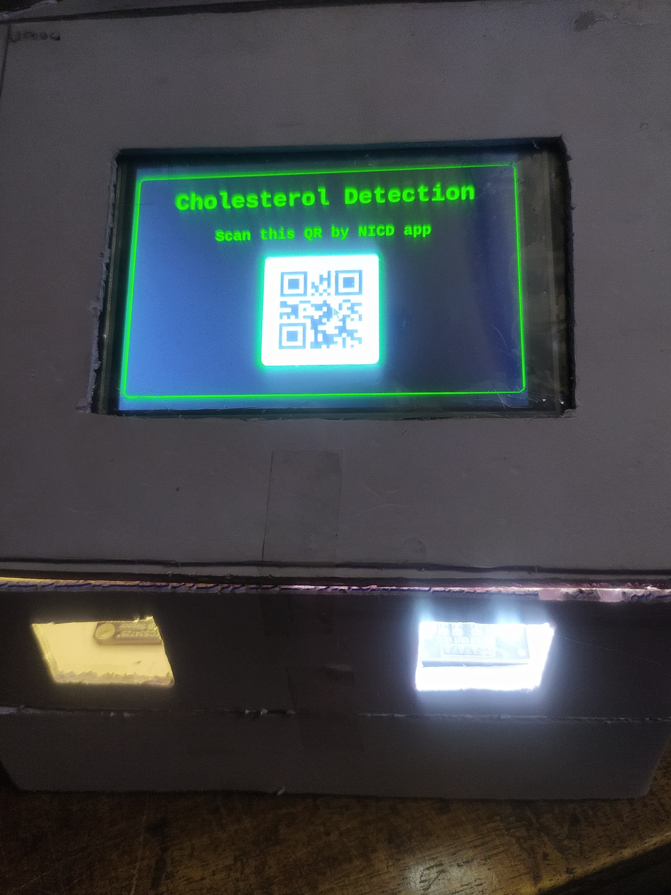
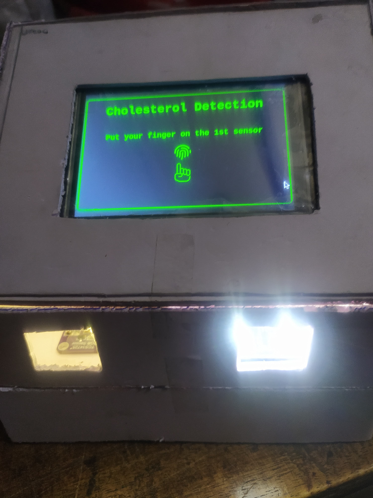
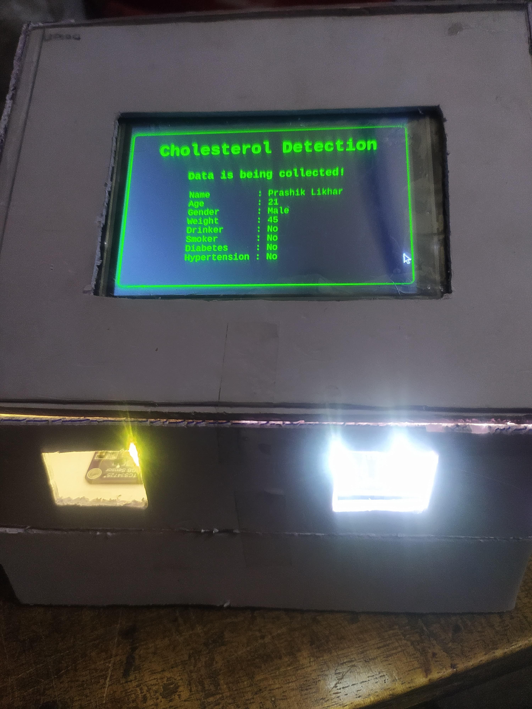
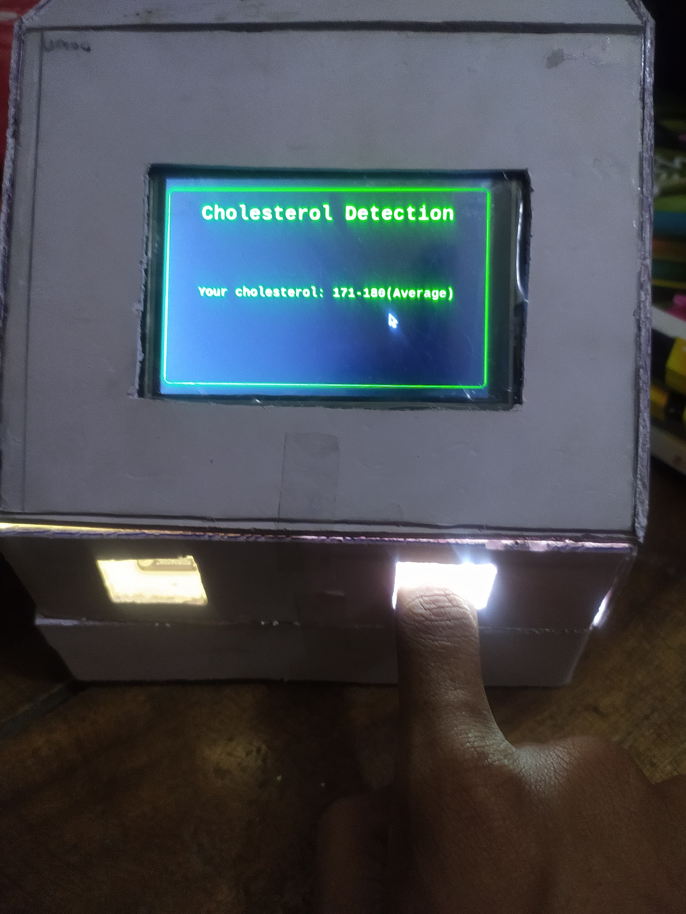

# Non-Invasive Cholesterol Detection (NICD)



## Description

The Non-Invasive Cholesterol Detection (NICD) project aims to provide a seamless and non-invasive method to measure cholesterol levels using IoT devices. The system utilizes a combination


 of hardware components and software applications to gather user data, process sensor inputs, and predict cholesterol levels using machine learning models.

## Shield.io Badges


## Project Demo

A demo of the project can be accessed [here](https://www.youtube.com/watch?v=wRZQ12fLi4c).

## Project Screenshots
https://github.com/user-attachments/assets/65c06004-641d-484f-bb12-769085125d7e

<div style="display: flex; justify-content: space-between;">
  
  
</div>

<div style="display: flex; justify-content: space-between;">
  
  
  
</div>

## Features

- **User Information Input**: Start by scanning a QR code to input user details such as name, age, gender, weight, and lifestyle factors (drinker, smoker, blood pressure, hypertension).
- **Sensor Integration**: Utilizes TCS34725 and TCS3200 color sensors to gather data from the user.
- **Machine Learning Prediction**: Processes sensor data through a machine learning model to predict cholesterol levels.
- **Cross-Platform Compatibility**: Android app for user interaction and data transmission to Raspberry Pi.
- **User-Friendly Interface**: Display results on an LCD screen for easy reading.

## Hardware Components

- **Color Sensors**: TCS34725 & TCS3200
- **Raspberry Pi 4**
- **Arduino Uno**
- **LCD Screen**

## Software Components

- **Frontend**: Python Django
- **Machine Learning**: Python
- **Mobile App**: Java

## Getting Started

1. **Clone the Repository**: 
   ```bash
   git clone https://github.com/xn-coder/NICD.git
   ```

2. **Set Up Hardware**: Connect the sensors and LCD screen to the Raspberry Pi and Arduino Uno as per the circuit diagram.

3. **Install Dependencies**: 
   - For Python: 
     ```bash
     pip install -r requirements.txt
     ```
   - For Java: Ensure you have the necessary Android development environment set up.

4. **Run the Application**: 
   - Start the Django server for the frontend.
   - Deploy the Android app on a compatible device.

5. **Usage**: 
   - Scan the QR code to input user data.
   - Follow on-screen instructions to place your finger on the sensors.
   - View the predicted cholesterol level on the LCD screen.

## License

This project is licensed under the GNU License - see the [LICENSE](LICENSE) file for details.

## Contact

For any inquiries, please contact [prashiklikhar009@gmail.com](mailto:prashiklikhar009@gmail.com).
